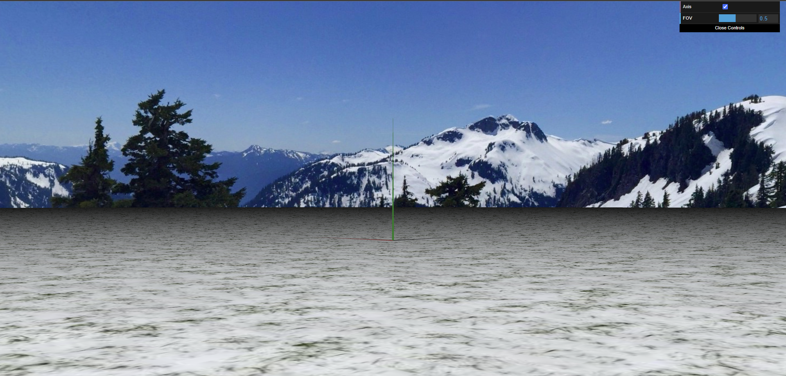

# CG 2024/2025

## Group T04G06

| Name               | Number    | E-Mail            |
| ------------------ | --------- | ----------------- |
| Ana Rita Pereira   | 202108798 | up202108798@up.pt |
| Tomás Sucena Lopes | 202108701 | up202108701@up.pt |

## Project

### 1. Skysphere

|  |
| :-------------------------------------------: |
|    **Figure 1:** A skysphere (front view)     |

|  |
| :---------------------------------------------: |
|      **Figure 2:** A skysphere (back view)      |

## Observations

This submission is incomplete. For instance, the fire has already been implemented but is not yet a part of the scene. Likewise, the helicopter still does not drop water from the bucket. Nevertheless, the final project will be completed before the presentation on Tuesday.
