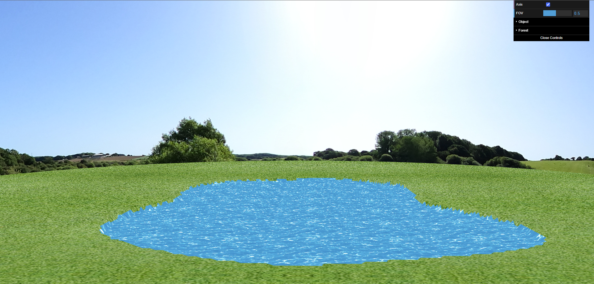
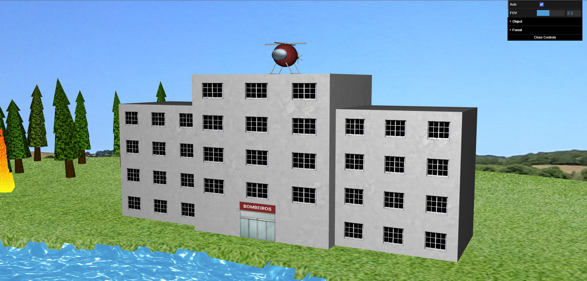
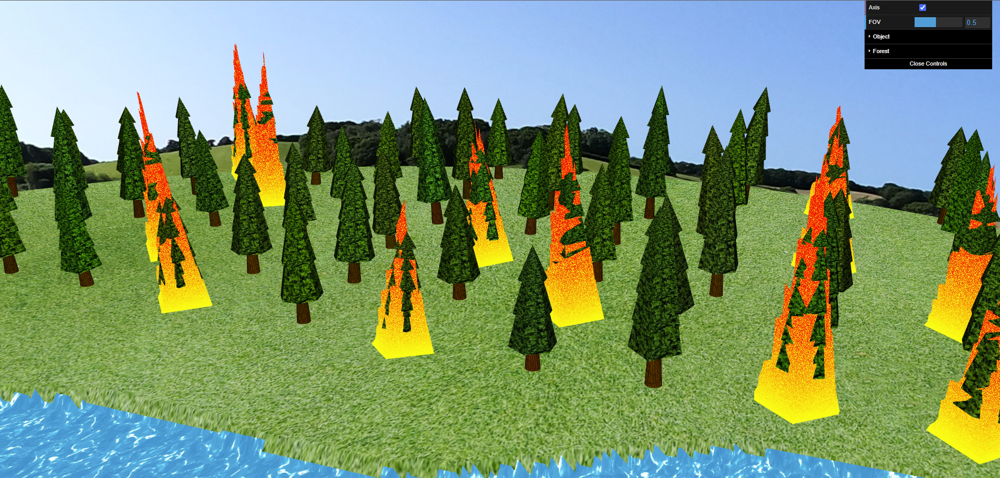
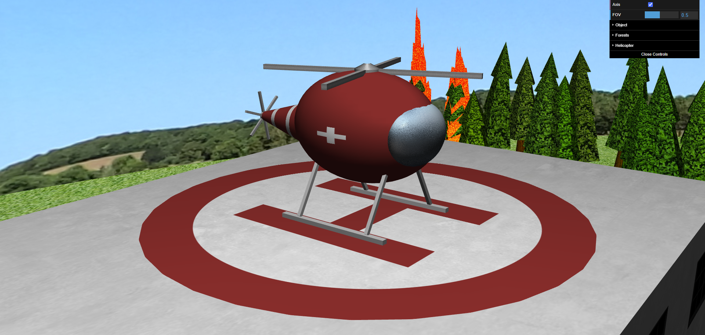
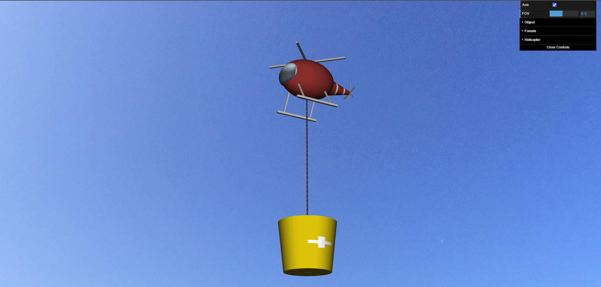
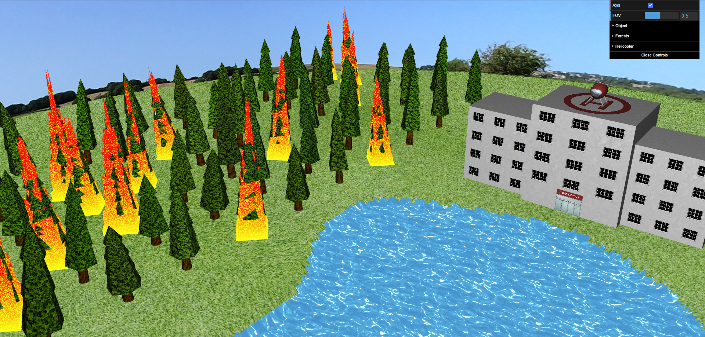
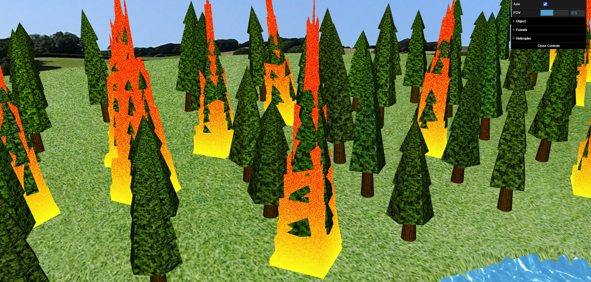
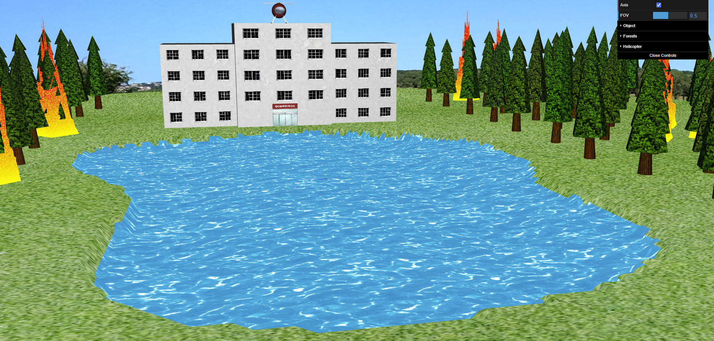

# CG 2024/2025

## Group T04G06

| Name               | Number    | E-Mail            |
| ------------------ | --------- | ----------------- |
| Ana Rita Pereira   | 202108798 | up202108798@up.pt |
| Tomás Sucena Lopes | 202108701 | up202108701@up.pt |

## Project

### 1. Skysphere

|  |
| :-------------------------------------------: |
|           **Figure 1:** A skysphere           |

### 2. Building

|  |
| :-------------------------------------------: |
|   **Figure 2:** The firefighter's building    |

### 3. Forest

|  |
| :-------------------------------------------: |
|            **Figure 3:** A forest             |

### 4. Helicopter

|  |
| :-------------------------------------------: |
|  **Figure 4:** The firefighter's helicopter   |

|  |
| :-------------------------------------------: |
|     **Figure 5:** Helicopter in movement      |

### 5. Water and Fire

|  |
| :-------------------------------------------: |
|     **Figure 6:** The lake and a wildfire     |

|  |
| :-------------------------------------------: |
|           **Figure 7:** A wildfire            |

### 6. Lake

|  |
| :-------------------------------------------: |
|            **Figure 8:** The lake             |

## Observations

We did not implement point 6.2 - `Heliport in maneuvers`.

## Use of AI

We only utilized artificial intelligence for two purposes:

- To debug our code when the error messages were insufficient.
- To get ideas for how to implement the [fire vertex shader](shaders/fire.vert). While it was certainly very helpful, it provided code that was far too overcomplicated, so we ended up changing it a lot to ensure we understood what was happening.

Regarding the models, we relied on Chat-GPT and Gemini.
