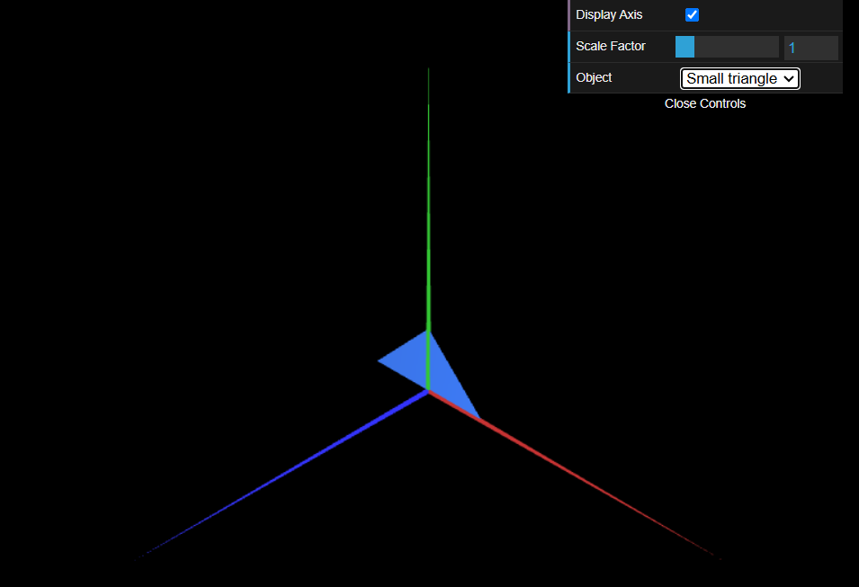
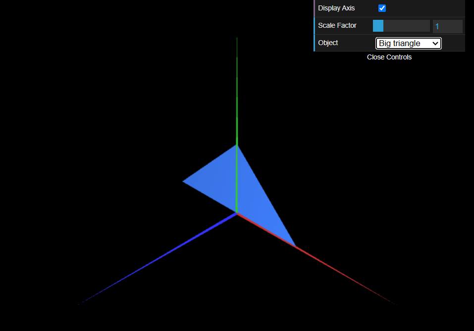

# CG 2024/2025

## Group T04G06

## TP 1 Notes

In this practical assignment, we learned the basics of object modelling in WebCGF. This process consists of two phases: defining the object's **vertices** and establishing its visible faces using **indices**.

- In exercise 1, we modified the source code of the provided [diamond](objects/MyDiamond.js) to create two new objects: a [rectangle triangle](objects/MyTriangle.js) and a [parallelogram](objects/MyParallelogram.js). For all objects, we also ensured both their front and back faces were visible. At first, we struggled with declaring the indices, but we gradually got accustomed to it.
- In exercise 2, we repeated the same process to create two new rectangle triangles of varying sizes. Figure 1 and Figure 2 showcase the [smaller](objects/MyTriangleSmall.js) and [larger](objects/MyTriangleBig.js) triangles, respectively.

|  | 
|:--:|
| **Figure 1:** A small rectangle triangle |

|  |
|:--:| 
| **Figure 2:** A big rectangle triangle |
