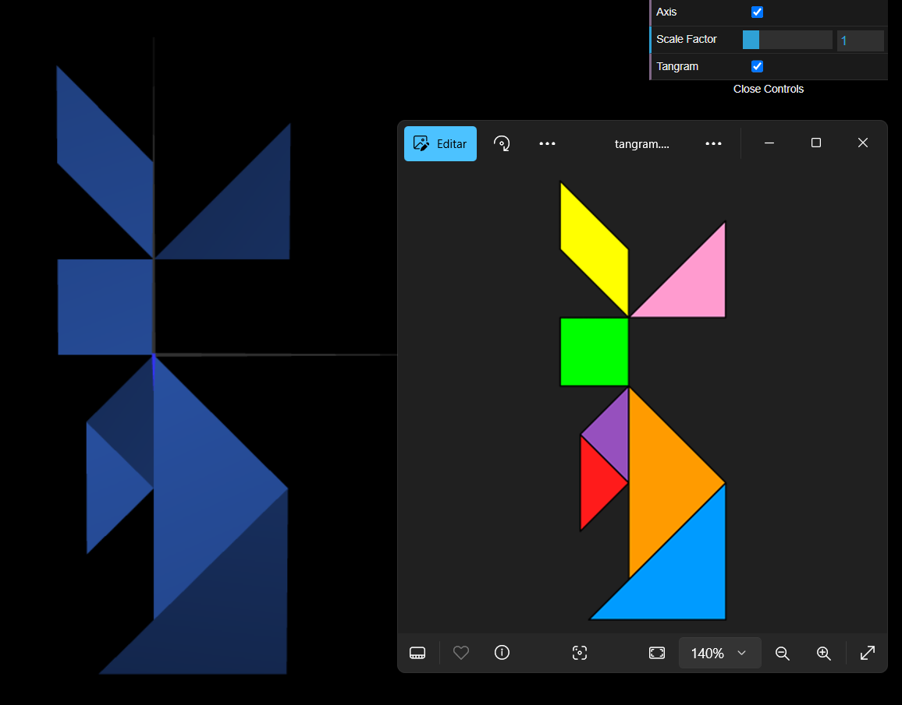

# CG 2024/2025

## Group T04G06

## TP 2 Notes

In this practical assignment, we learned how to apply geometric transformations - **translation**, **scaling**, and **rotation** - to position and modify objects.

- In exercise 1, we transformed the objects we created in the previous assignment to build a [tangram](objects/MyTangram.js), as Figure 1 illustrates. We struggled with manually computing the transformation matrices, but fortunately we could rely on the `translate()`, `scale()`, and `rotate()` methods to do so for us.

|  |
| :------------------------------------------: |
|           **Figure 1:** A tangram            |
