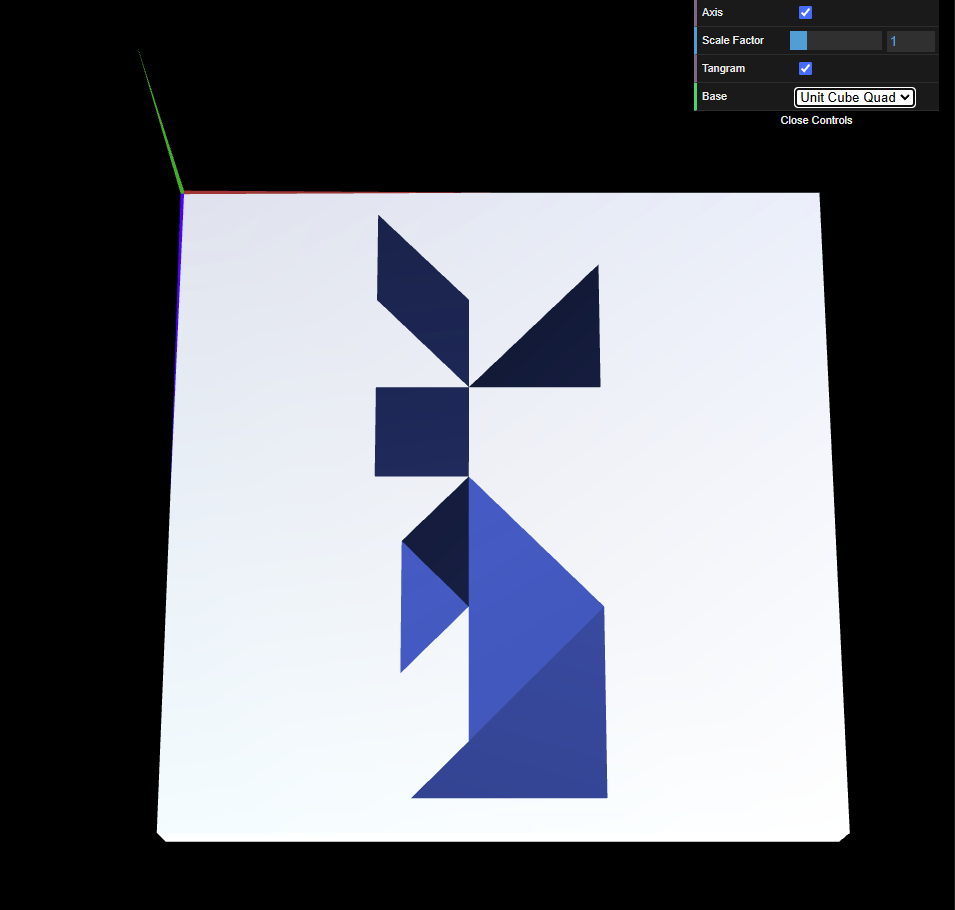

# CG 2024/2025

## Group T04G06

## TP 2 Notes

In this practical assignment, we learned how to apply geometric transformations - **translation**, **scaling**, and **rotation** - to position and modify objects.

- In exercise 1, we transformed the objects we created in the previous assignment to build a [tangram](objects/MyTangram.js), as Figure 1 illustrates. We struggled with manually computing the transformation matrices, but fortunately we could rely on the `translate()`, `scale()`, and `rotate()` methods to do so for us.

|  |
| :------------------------------------------: |
|           **Figure 1:** A tangram            |

- In exercise 2, we created our first 3D object: a [cube](objects/MyUnitCube.js). To do so, we defined its **vertices** and **indices**, just like we did to model the shapes from the previous assignment. This approach for modelling 3D objects turned out to be a bit harder than we anticipated, but it was still pretty doable. Then, we utilized geometric transformations to repurpose the cube as a base for the tangram, as shown in Figure 2.

|  |
| :------------------------------------------: |
|     **Figure 2:** A tangram with a base      |

- For exercise 3, we recreated the cube, but this time, instead of defining its geometry, we modelled it by applying geometric transformations to a [square](objects/MyQuad.js). Creating the square was pretty straightforward and using geometric transformations was much simpler than manually defining the geometry. We then replaced the cube from the previous exercise with the new cube in the main scene, making it the new base for the tangram, as shown in Figure 3.

|  |
| :------------------------------------------: |
|   **Figure 3:** A tangram with a new base    |
