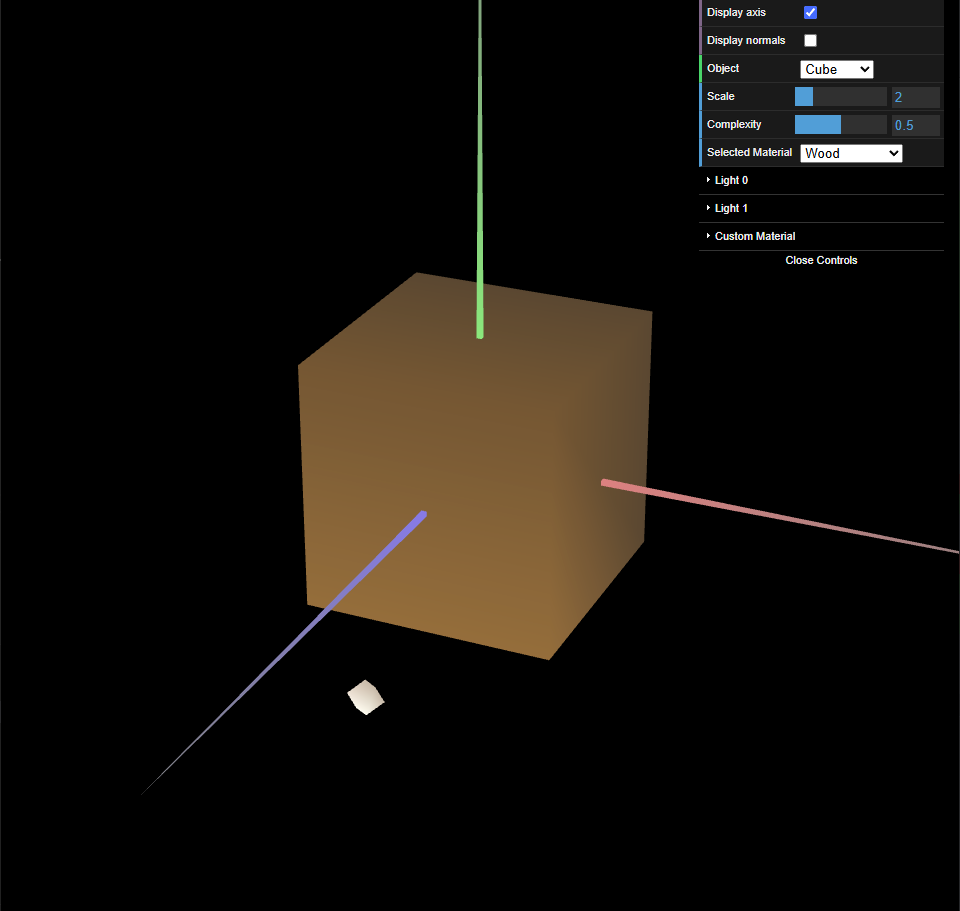
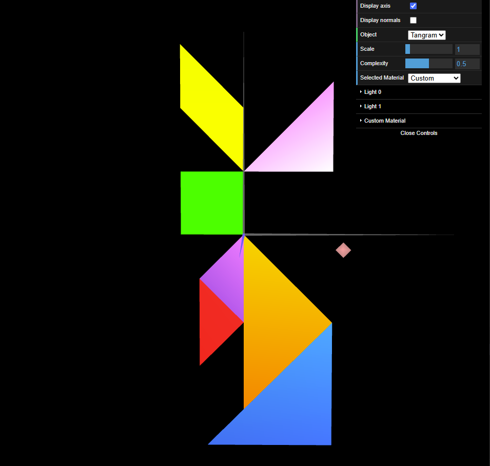

# CG 2024/2025

## Group T04G06

## TP 3 Notes

In this practical assignment, we learned how to define an object's **normals**, thus changing how it interacts with the light sources. In addition, we also learned how to apply **materials** to change an object's color.

- In exercise 1, we updated the [unit cube](objects/solids/MyUnitCube.js) by defining its normals. Considering each normal is mapped to a vertex and each vertex belongs to three faces, we had to repeat the vertices three times. Then, we created a new wooden material and applied it. Finally, we created new materials to color each of the [tangram](objects/MyTangram.js) pieces.

|  |
| :------------------------------------------: |
| **Figure 1:** A cube with a wooden material  |

|  |
| :------------------------------------------: |
|           **Figure 2:** A tangram            |
