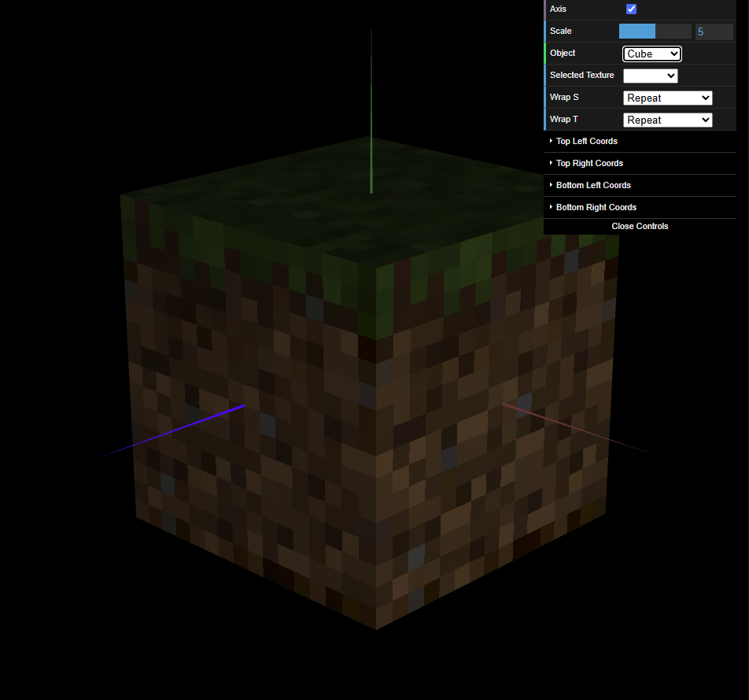

# CG 2024/2025

## Group T04G06

## TP 4 Notes

In this practical assignment, we learned how to apply **textures** to our objects, thus changing their appearance without modifying their geometry. This process consists of mapping the object's vertices to an image by defining its **texture coordinates**.

- In exercise 1, we were tasked with applying a texture to the [tangram](objects/MyTangram.js). To that end, we defined the texture coordinates for each of its objects and then binded the texture to their materials. Given each object had its designated area on the texture, defining the texture coordinates was a bit tricky but still very doable.

|  |
| :------------------------------------------: |
|  **Figure 1:** A tangram w/ textured shapes  |

- In exercise 2, we applied textures to a [cube](objects/solids/MyUnitCubeQuad.js) in order to recreate the iconic Minecraft cube. However, the provided textures were only 16x16 pixels and, as such, did not fully cover the cube's faces. Given that, by default, WebGL performs **linear interpolation** of the colors, the initial result looked very blurry. To fix this, we explicitly changed the filtering mode from `LINEAR` to `NEAREST` before applying the textures, which yielded much better results.

|  |
| :------------------------------------------: |
|        **Figure 2:** A Minecraft cube        |
