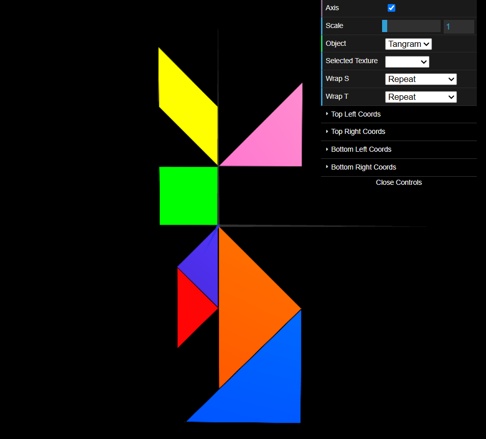

# CG 2024/2025

## Group T04G06

## TP 4 Notes

In this practical assignment, we learned how to apply **textures** to our objects, thus changing their appearance without modifying their geometry. This process consists of mapping the object's vertices to an image by defining its **texture coordinates**.

- In exercise 1, we were tasked with applying a texture to the [tangram](objects/MyTangram.js). To that end, we defined the texture coordinates for each of its objects and then binded the texture to their materials. Given each object had its designated area on the texture, defining the texture coordinates was a bit tricky but still very doable.

|  |
| :------------------------------------------: |
|           **Figure 1:** A tangram            |
