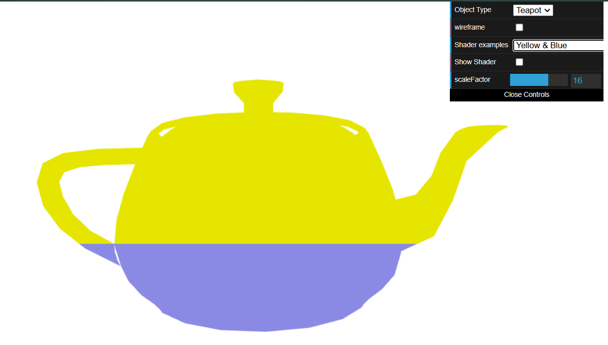
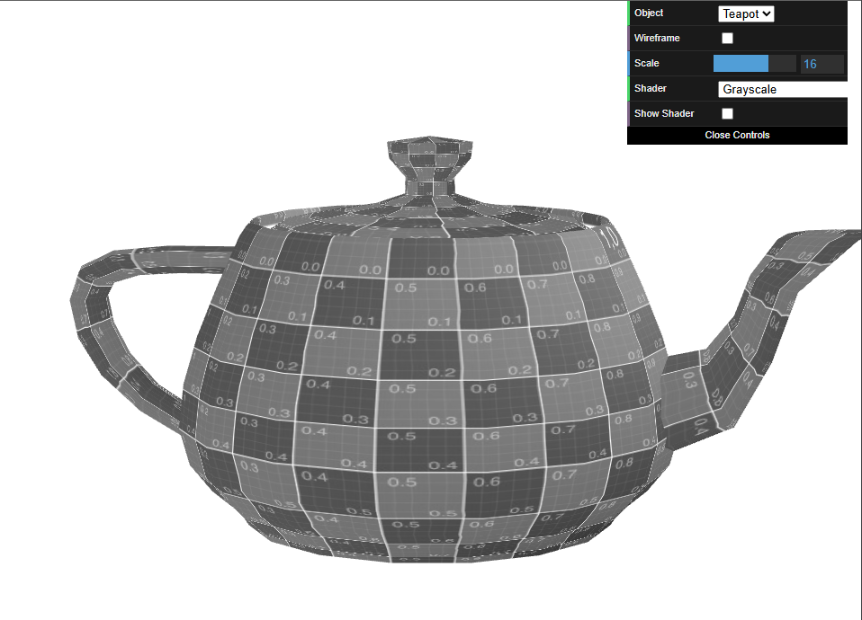

# CG 2024/2025

## Group T04G06

## TP 5 Notes

In the final practical assignment, we learned how to use **shaders**. There are two types of shaders: **vertex** and **fragment** shaders.

- In exercise 1, we created a fragment shader to color an object's vertices according to their position on the screen: yellow if they appear on the upper half ($y > 0.5$), blue otherwise. Then, we created the respective vertex shader to alter the position of the vertices.

|  |
| :------------------------------------------: |
|    **Figure 1:** A blue and yellow teapot    |

|  |
| :------------------------------------------: |
|       **Figure 2:** A grayscale teapot       |
