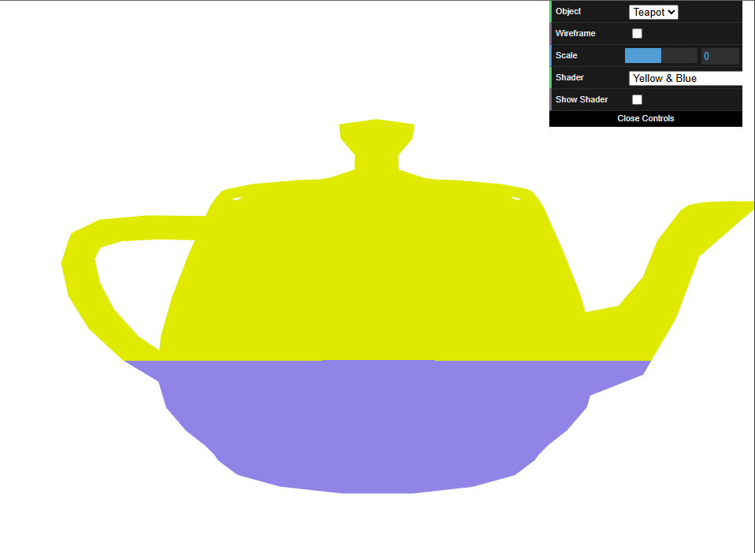

# CG 2024/2025

## Group T04G06

## TP 5 Notes

In the final practical assignment, we learned how to use **shaders**. There are two types of shaders: **vertex** and **fragment** shaders. The former concerns object geometry and is applied on every vertex, while the latter defines shading and texture details and is applied on every pixel.

- In exercise 1, we created a fragment shader - [blue&yellow.frag](shaders/yellow&blue.frag) - to color an object's vertices according to their position on the screen: yellow if they appear on the upper half ($y > 0.5$), blue otherwise. Then, we created the respective vertex shader to repeatedly translate the object back and forth on the X-axis. Finally, we created a new fragment shader - [grayscale.frag](shaders/grayscale.frag) - that converts an object's colors to grayscale by applying the following formula:

$$Gray = 0.299 \times R + 0.587 \times G + 0.114 \times B$$

|  |
| :------------------------------------------: |
|    **Figure 1:** A blue and yellow teapot    |

|  |
| :------------------------------------------: |
|       **Figure 2:** A grayscale teapot       |
